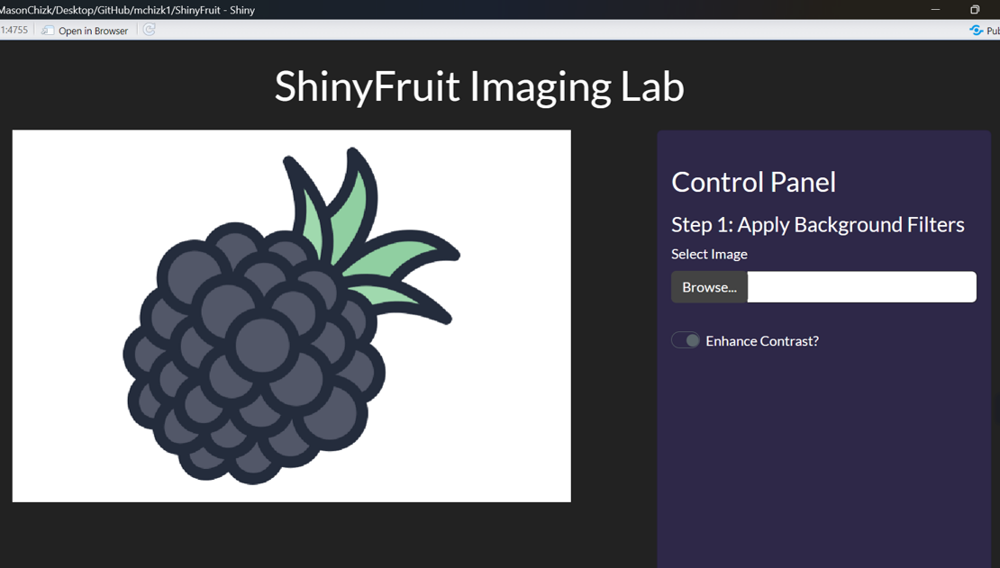
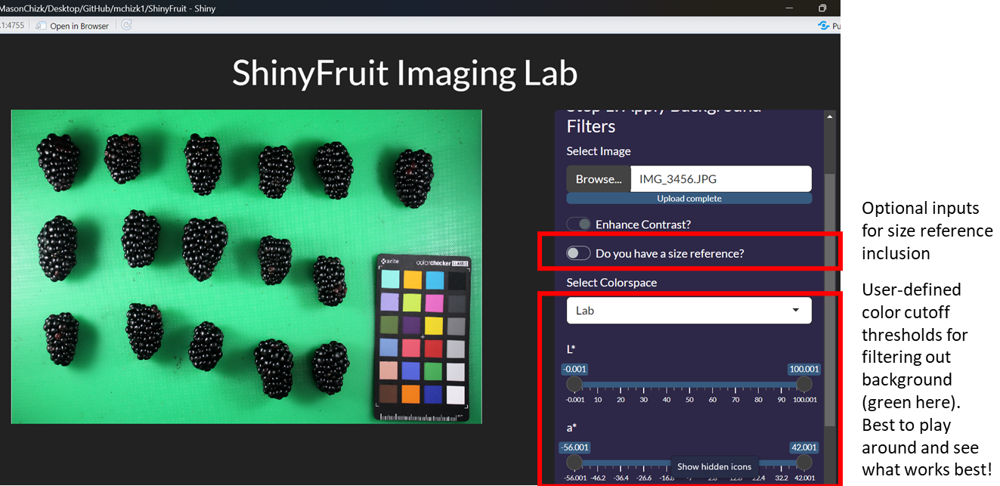
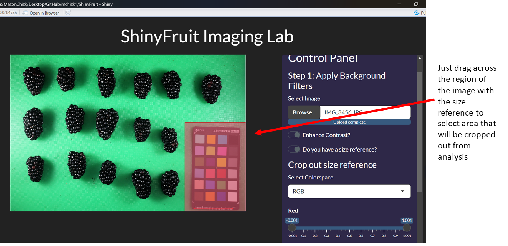
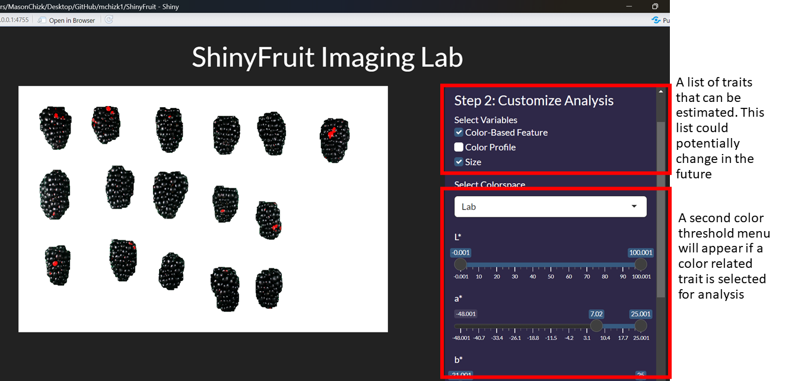

```{r, include = FALSE}
knitr::opts_chunk$set(
  collapse = TRUE,
  comment = "#>"
)
```

```{r setup}
library(ShinyFruit)
```


## ShinyFruit Tutorial

ShinyFruit is an R-based application that is currently capable of analyzing images of small fruits (and probably veggies too!). It was 
created using `shiny` framework, and is currently capable of measuring fruit size (length, width, and area), color defect proportions,
and detailed color profiles of selected regions. Follow this guide to get started!

Any questions, feedback, or suggestions for new features can be directed to mchizk1@gmail.com

### Step 1. Running ShinyFruit locally

Simply run the following line of code to boot up the ShinyFruit GUI

    ShinyFruit::run_app()
    
This should open the user interface shown below

{width=75%}

### Step 2. Load sample image

Interacting with the browser button should open the file search dialog. There are a few general rules that should be 
followed when collecting images for ShinyFruit analysis:

* jpg is currently the only supported format. I will probably add support for others like png in the future.
* inclusion of a known size standard is highly recommended (allows useful size analysis)
* If multiple pictures are taken, lighting conditions and camera height should be kept as consistent as possible, such
that filters used on image A still apply to images B-Z
* Test images should be in their own dedicated folder with no other irrelevant files or subfolders.
* Size analysis assumes that fruit are oriented with the top facing away from the photographer. 
* Having *at least* half an inch of spacing between fruits should help ensure that the fruit is counted correctly and independently.
* The background should not contain any color that may potentially be found on the fruit itself.

{width=75%}

### Step 3. Set size standard (optional but highly recommended)

If a size standard is present in the sample image, click on the relevant switch.  This should open up a couple new options for data entry.

{width=75%}

### Step 4. Crop out the size standard (only if provided)

If a size standard is provided, there is a good chance that it will interfere with the analysis unless it is cropped out entirely.  For this 
reason, it is recommended to always have the size reference present in the same part of the picture.  The settings for cropping, like all 
other settings, will applied to all images in a batch analysis.

{width=75%}

### Step 5. Filter out background area

Before conducting the analysis, the user must define the color thresholds that should be used to remove the background from the image.
This step requires some experimentation, but if images were taken in a consistent way, there should be an effective threshold that can
be applied to all images in the set. In addition, there is support for multiple color spaces to experiment with.  If RGB thresholds don't
work well for the image, try Lab or HSB!  Future updates may add even more color spaces for more flexible thresholding options.

{width=75%}

### Step 6. Select traits for analysis!!!

Finally! Here's the fun part...

{width=75%}

### Step 7. Run the batch analysis

All current settings will be applied to all images in the selected input directory.  Including images in the output data will slow down the analysis, but will provide the user with a chance to visually check the quality of the analyis against the original images. All the data 
requested will be included in a single output csv file, with each image representing a row and each column representing a trait.

{width=75%}
